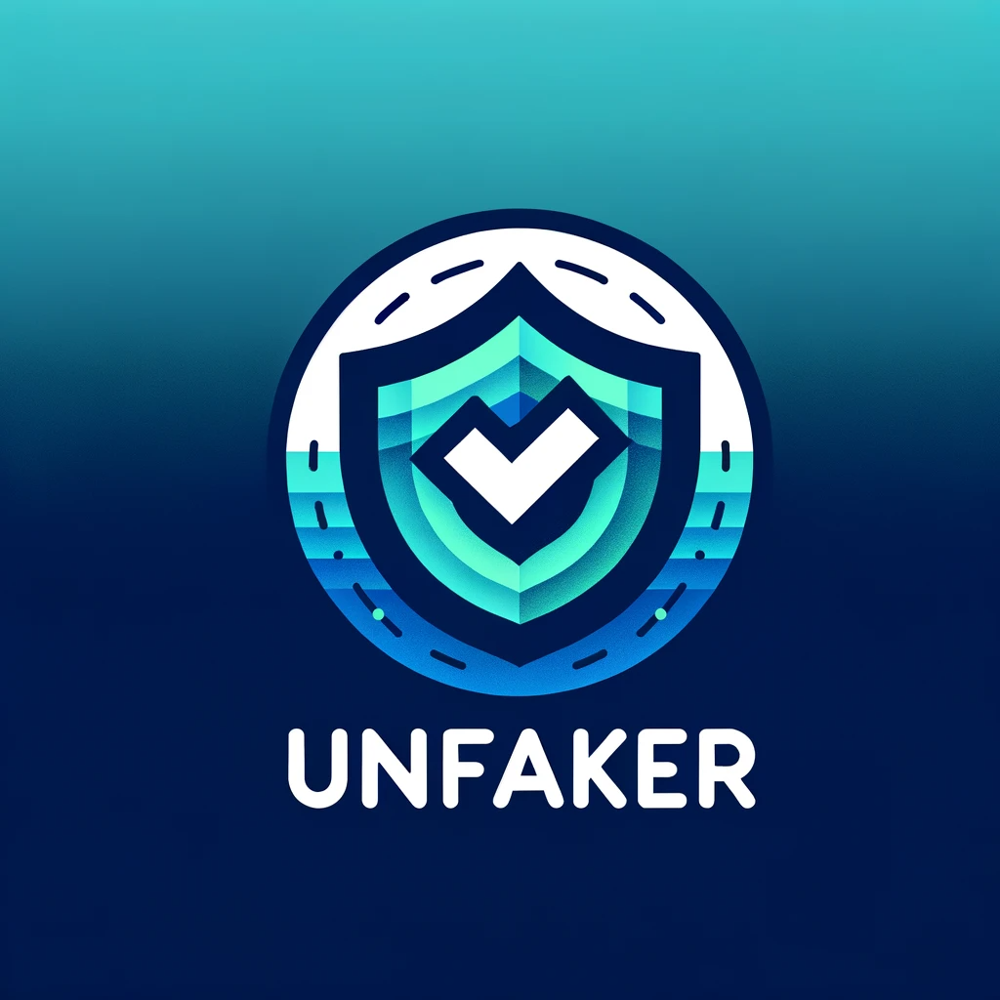

# Unfaker
This app is for interview task in field of Deepfake detection built by Next JS



## Getting Started

To run locally, firstly install npm packages:

```bash
npm install
```

Then, run the development server:

```bash
npm run dev
# or
yarn dev
# or
pnpm dev
# or
bun dev
```

Open [http://localhost:3000](http://localhost:3000) with your browser to see the result.


## Tech Stack

- NextJS 14
- TypeScript
- Tailwind CSS
- NextUI
- Framer Motion
- React-Toastify
- React-Dropzone


## Features on Website

- Landing Page 
- Signup (Mock)
- Login
- Log Out
- File drop
- File Validation
- File processing
- Real Time Analyzing
- Background Analyzing